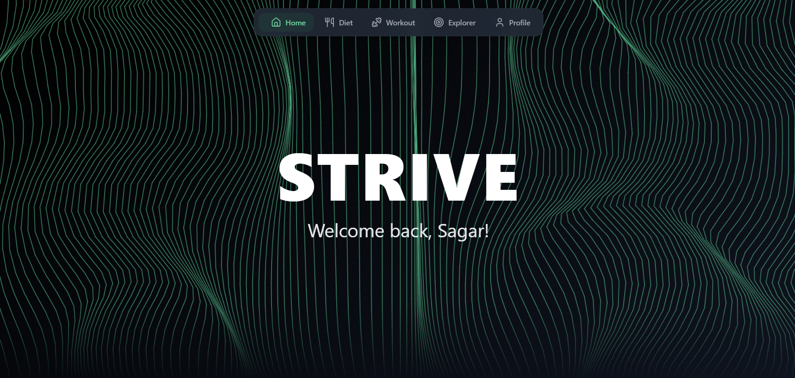

## STRIVE – Your personal fitness companion — Diet, Workouts & More

<p align="center">
  
</p>

<p align="center">
  
</p>

Strive is a modern fitness web application built with React (TypeScript + Vite) and TailwindCSS. It helps you plan workouts, generate diet plans, explore stretch libraries, run calculators (BMI, BMR, Calories, 1RM), and more — all with a delightful UI and optional AI assistance. Designed with Indian users in mind: currency is INR and diet recommendations can be tailored to local preferences.

### About the Project

Strive’s goal is to simplify fitness planning:
- Help users generate weekly workout splits based on experience, available days, location (gym/home/hybrid), and goal.
- Provide personalized diet plans using user inputs such as current weight, target weight, goal, and budget (in INR).
- Offer an Explore (Body Explorer) area with calculators, stretch library, and fun challenges.
- Maintain user profile details and preferences with Supabase as the backend.

### Features

- 🏋️‍♂️ Workout Page: Personalized exercises and progress tracking.
- 🍽 Diet Page: Meal plans based on current weight, goal weight, fitness goal, and budget in INR. Export meal plans as PDF.
- 📊 Explore (Body Explorer):
  - Calculators: BMI, BMR, Calorie Estimator, and 1RM.
  - Challenges: 30-day pushup, plank, and more; community polls/quizzes.
  - Stretch Library: Interactive muscle selection → stretches mapping.
  - Split Generator: Beginner → Advanced, gym/home/hybrid, optional cardio toggle.
- 👤 Profile Page: Manage user details, goals, and preferences.
- 🔗 Supabase Integration: Store user data (weight, goals, preferences, frequency).
- 🤖 AI Integration: Generate personalized diet plans via Gemini/OpenAI (optional).

### Tech Stack

- Frontend: React 18 (TypeScript, Vite), TailwindCSS, shadcn/ui components, Framer Motion, React Bits.
- Backend/DB: Supabase.
- AI APIs: Axios, Gemini (Google Generative AI) for diet plan generation.
- Authentication: bcrypt, JWT.
- Deployment: Vercel (recommended), Netlify (optional).

### Folder Structure

```
Strive/
├── src/
│   ├── components/         # Reusable UI components
│   │   ├── Dashboard, Diet, Workout, Explore (BodyExplorer), Profile
│   ├── lib/                # API clients (supabase, workout split, gemini)
│   ├── assets/             # Images, icons
│   ├── data/               # Stretch library data
│   └── App.tsx
├── public/                 # Static assets (e.g., strive-icon2.png, strive.png)
├── server/                 # API utility (proxy endpoint for AI calls)
├── package.json
└── README.md
```

### Getting Started

#### Prerequisites
- Node.js (LTS recommended)
- npm (or yarn/pnpm)
- A Supabase project (URL + anon key)

#### Installation

```bash
git clone https://github.com/CodeByAshuu/Strive.git
cd Strive
npm install
# Optional (already included via package.json in most setups)
npm install react-body-highlighter

# Start the local proxy server for AI requests (port 3001)
cd server
node proxy.js

# In a separate terminal
cd ..
npm run dev
```

#### Environment Variables

Create a `.env` file at the project root and add:

```
VITE_SUPABASE_URL=your_supabase_url
VITE_SUPABASE_ANON_KEY=your_supabase_anon_key

# Used by server/proxy.js
GEMINI_API_KEY=your_gemini_api_key
```

Notes:
- The frontend calls a local proxy at `http://localhost:3001/api` for AI endpoints. Ensure the server is running.
- For production deployments (e.g., Vercel), configure the same environment variables in the project settings.

### Usage

- Navigate between pages from the app’s navigation:
  - Workout: View personalized exercises and track progress.
  - Diet: Generate meal plans based on your inputs; download PDFs.
  - Explore: Use calculators, take challenges, browse the stretch library, or generate a workout split.
  - Profile: Update your age, height, weight, goal, and frequency preferences.

#### Example: Generate a Diet Plan
1. Open Diet Page.
2. Enter current weight, goal weight, fitness goal, and budget (INR).
3. Click Generate — Strive (optionally using Gemini) will produce a tailored plan.
4. Download as PDF if desired.

#### Example: Generate a Workout Split
1. Go to Explore → Split Generator.
2. Choose Experience (Beginner/Intermediate/Advanced), Days/Week, Location (Gym/Home/Hybrid), and toggle Cardio if needed.
3. Click Generate Weekly Split to view detailed day-wise workouts.

Strive is fully responsive and works well on mobile, tablet, and desktop.

### Future Enhancements

- More regional Indian diet variations.
- Gamification with badges and leaderboards.
- Community forum integration.

### Contributing

Contributions are welcome! Please open an issue to discuss changes or submit a pull request:
- Fork the repository
- Create a feature branch
- Commit your changes with clear messages
- Open a PR describing the motivation and approach

### License

MIT License

### Acknowledgements

- Supabase
- Google Gemini (Generative AI)
- TailwindCSS
- shadcn/ui
- React Bits
- Recharts
- Framer Motion
- rehabhero.co (for stretch images)
